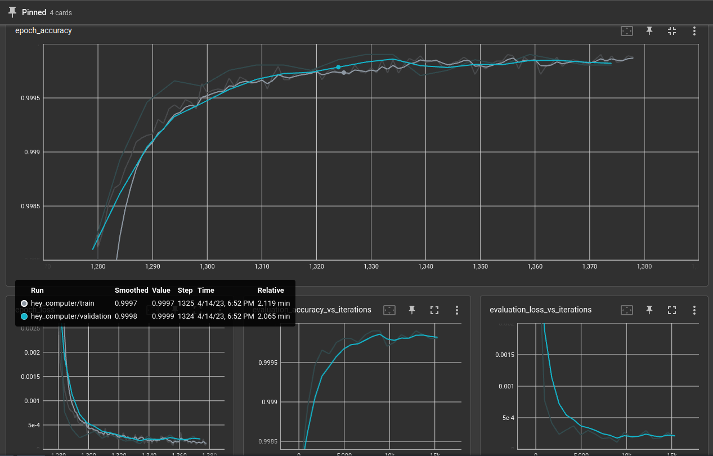
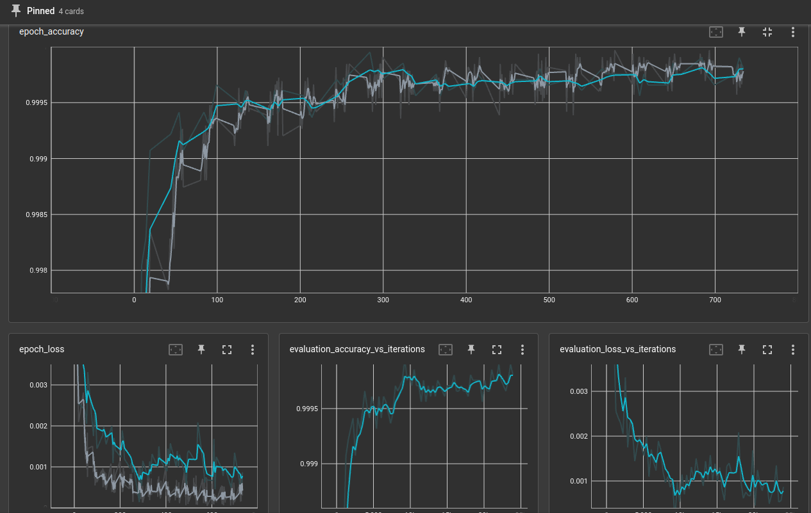
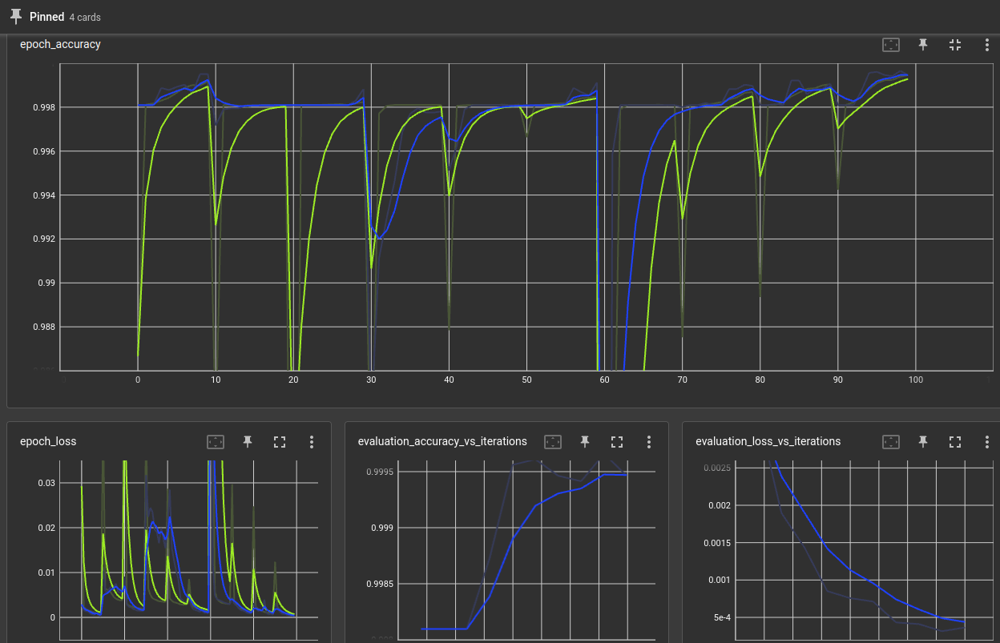

# OpenVoiceOS precise trainer

WIP - open during construction, setup.py and command line entry points are not yet provided

Several training strategies are available, each may provide better results for different datasets and wake words, some sounds might be easier to learn than others and the kinds of data available for each word will be different

- train - select epochs, batch size and go!
- train with replacement - use a different subset of the training data in every epoch, helps avoid overfitting
- train incremental - every epoch test the model and move false positives to training set, helps if you have an unbalanced dataset (a lot not-ww samples)
- train incremental with replacement - unbalanced dataset + overfitting to specific voices
- train optimized - using [bbopt](https://github.com/evhub/bbopt) search the optimal hyperparams (dropout and recurrent units), train several models and keep best one
- train optimized incremental
- train optimized with replacement


# Converting / Testing

```python
from precise_trainer import PreciseTrainer

# convert a previous model
model_file = ".../my_model"
PreciseTrainer.convert(model_file, model_file + ".tflite")

# test a previous model
model_file = ".../my_model.tflite"
folder = f"/home/user/ww_datasets/my_dataset"  # dataset here
PreciseTrainer.test_from_file(model_file, folder)
```

# Training

```
from precise_trainer import PreciseTrainer

model_name = "hey_computer"
folder = f"/home/user/ww_datasets/{model_name}"  # dataset here
model_path = f"/home/user/trained_models/{model_name}"  # save here
log_dir = f"logs/fit/{model_name}"  # for tensorboard

# train a model
trainer = PreciseTrainer(model_path, folder, epochs=100, log_dir=log_dir)
model_file = trainer.train()
# Data: <TrainData wake_words=155 not_wake_words=89356 test_wake_words=39 test_not_wake_words=22339>
# Loading wake-word...
# Loading not-wake-word...
# Loading wake-word...
# Loading not-wake-word...
# Inputs shape: (81602, 29, 13)
# Outputs shape: (81602, 1)
# Test inputs shape: (20486, 29, 13)
# Test outputs shape: (20486, 1)
# Model: "sequential"
# _________________________________________________________________
#  Layer (type)                Output Shape              Param #   
# =================================================================
#  net (GRU)                   (None, 20)                2100      
#                                                                  
#  dense (Dense)               (None, 1)                 21        
#                                                                  
# =================================================================
# Total params: 2,121
# Trainable params: 2,121
# Non-trainable params: 0
# .....
# _________________________________________________________________
# Epoch 1280/1379
# 157/160 [============================>.] - ETA: 0s - loss: 0.0308 - accuracy: 0.9868
# ....
# Wrote to /home/miro/PycharmProjects/ovos-audio-classifiers/trained/hey_computer/model.tflite
trainer.test()

# === Counts ===
# False Positives: 2
# True Negatives: 20445
# False Negatives: 2
# True Positives: 37
# 
# === Summary ===
# 20482 out of 20486
# 99.98%
# 
# 0.01% false positives
# 5.13% false negatives

```
tensorboard should produce something like this




# Train with replacement

```python
from precise_trainer import PreciseTrainer

model_name = "hey_computer"
folder = f"/home/user/ww_datasets/{model_name}"  # dataset here
model_path = f"/home/user/trained_models/{model_name}"  # save here
log_dir = f"logs/fit/{model_name}"  # for tensorboard

# train a model
trainer = PreciseTrainer(model_path, folder, epochs=100, log_dir=log_dir)
model_file = trainer.train_with_replacement(mini_epochs=10)
trainer.test()
```
tensorboard should produce something like this



# Train incremental

```python
from precise_trainer import PreciseTrainer

model_name = "hey_computer"
folder = f"/home/user/ww_datasets/{model_name}"  # dataset here
model_path = f"/home/user/trained_models/{model_name}"  # save here
log_dir = f"logs/fit/{model_name}"  # for tensorboard

# train a model
trainer = PreciseTrainer(model_path, folder, epochs=100, log_dir=log_dir)

# pick one training method
model_file = trainer.train_incremental(mini_epochs=20)
# model_file = trainer.train_incremental_with_replacement(balanced=True, porportion=0.6)
trainer.test()
```


# Train optimized


```python
from precise_trainer import PreciseTrainer

model_name = "hey_computer"
folder = f"/home/user/ww_datasets/{model_name}"  # dataset here
model_path = f"/home/user/trained_models/{model_name}"  # save here
log_dir = f"logs/fit/{model_name}"  # for tensorboard

# train a model
trainer = PreciseTrainer(model_path, folder, epochs=100, log_dir=log_dir)

# pick one training method
model_file = trainer.train_optimized(cycles=20)
# model_file = trainer.train_optimized_with_replacement(porportion=0.8)
# model_file = trainer.train_optimized_incremental(cycles=50)
trainer.test()
```

tensorboard should produce something like this


