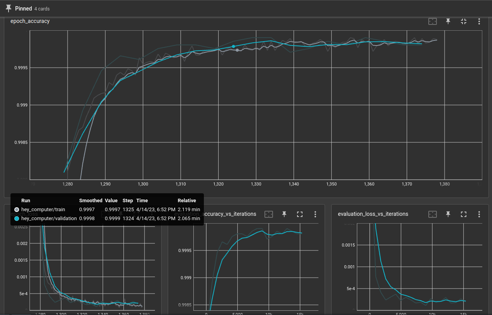
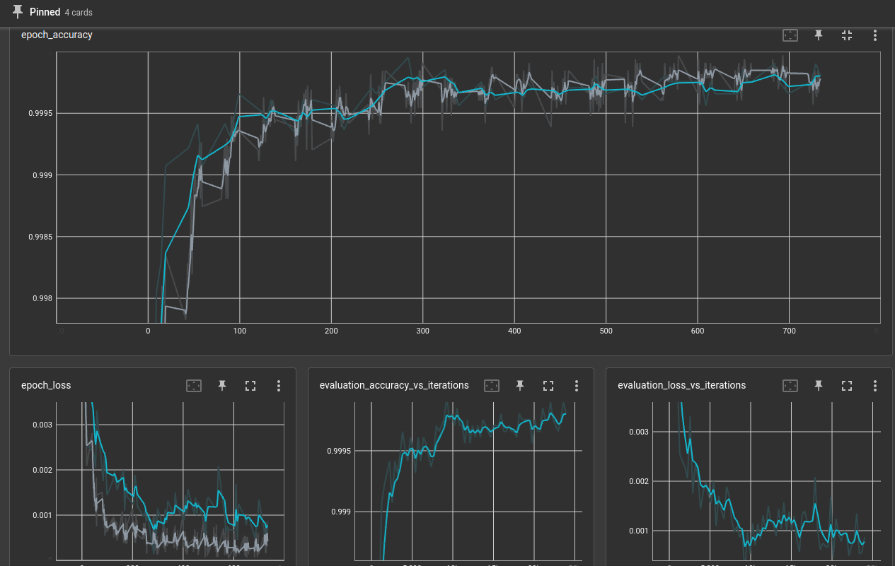
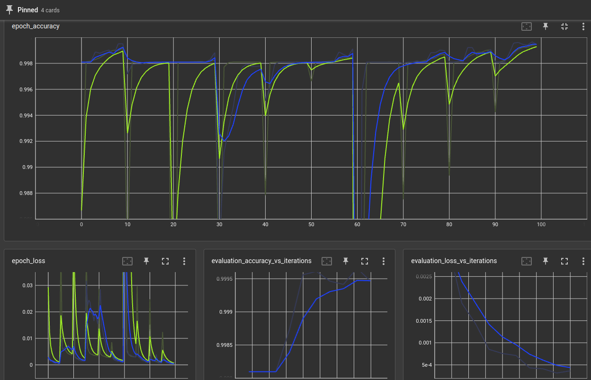

# OpenVoiceOS precise trainer

### Model Architecture

The wake word detection model is designed to be lightweight and efficient, suitable for real-time applications. It processes audio features using a simple architecture:

1. **Recurrent Layer**: A GRU layer captures temporal patterns in audio, enabling the model to understand sequential dependencies.
2. **Output Layer**: A fully connected layer with a sigmoid activation outputs the probability of the wake word being present.
3. **Custom Loss and Metrics**: The model uses a weighted loss function to balance sensitivity and specificity, with metrics like accuracy, false positives, and false negatives for detailed evaluation.

This streamlined design ensures robust performance with low computational overhead, making it ideal for resource-constrained environments.

### Resources

- [@SecretSauceAI Wake Word Data Collector](https://github.com/secretsauceai/wakeword-data-collector)
- [@SecretSauceAI Wake Word Trainer](https://github.com/secretsauceai/precise-wakeword-model-maker)
- [Synthetic Data Creation for Wake Words](https://github.com/OpenVoiceOS/ovos-ww-auto-synth-dataset)
- [Helpful Wake Word Datasets](https://huggingface.co/collections/Jarbas/wake-word-datasets-672cc275fa4bddff9cf69c39)
- [Architecture experiments from @MycroftAI](https://github.com/MycroftAI/mycroft-precise/wiki/Research)
- [Original training guide from @MycroftAI](https://github.com/MycroftAI/mycroft-precise/wiki/Training-your-own-wake-word) , contains details about dataset format etc


# Converting / Testing

```python
from precise_trainer import PreciseTrainer

# convert a previous model
model_file = ".../my_model.keras"
PreciseTrainer.convert(model_file, model_file + ".tflite")

# test a previous model
model_file = ".../my_model.tflite"
folder = f"/home/user/ww_datasets/my_dataset"  # dataset here
PreciseTrainer.test_from_file(model_file, folder)
```

⚠️ to convert old `.net` format precise models you need `tensorflow<=2.15.1` otherwise will get an error like this
> ValueError: File format not supported: Keras 3 only supports V3 `.keras` files and legacy H5 format files (`.h5` extension). Note that the legacy SavedModel format is not supported by `load_model()` in Keras 3.

# Training

Several training strategies are available, each may provide better results for different datasets and wake words, some sounds might be easier to learn than others and the kinds of data available for each word will be different

| Strategy                              | Description                                                                                   |
|---------------------------------------|-----------------------------------------------------------------------------------------------|
| `train`                               | Standard training with selected epochs and batch size.                                        |
| `train_with_replacement`              | Avoid overfitting by replacing the training subset every epoch.                               |
| `train_incremental`                   | Add false positives from testing set to training set, useful for unbalanced datasets.         |
| `train_incremental_with_replacement`  | Combines incremental training with replacement for more robust models.                        |
| `train_optimized`                     | Searches for optimal hyperparameters using `bbopt` and keeps the best model.                 |
| `train_optimized_incremental`         | Combines incremental training with hyperparameter optimization.                               |
| `train_optimized_with_replacement`    | Combines optimized training with replacement to reduce overfitting and improve robustness.    |


```
from precise_trainer import PreciseTrainer

model_name = "hey_computer"
folder = f"/home/user/ww_datasets/{model_name}"  # dataset here
model_path = f"/home/user/trained_models/{model_name}"  # save here
log_dir = f"logs/fit/{model_name}"  # for tensorboard

# train a model
trainer = PreciseTrainer(model_path, folder, epochs=100, log_dir=log_dir)
model_file = trainer.train()
# Data: <TrainData wake_words=155 not_wake_words=89356 test_wake_words=39 test_not_wake_words=22339>
# Loading wake-word...
# Loading not-wake-word...
# Loading wake-word...
# Loading not-wake-word...
# Inputs shape: (81602, 29, 13)
# Outputs shape: (81602, 1)
# Test inputs shape: (20486, 29, 13)
# Test outputs shape: (20486, 1)
# Model: "sequential"
# _________________________________________________________________
#  Layer (type)                Output Shape              Param #   
# =================================================================
#  net (GRU)                   (None, 20)                2100      
#                                                                  
#  dense (Dense)               (None, 1)                 21        
#                                                                  
# =================================================================
# Total params: 2,121
# Trainable params: 2,121
# Non-trainable params: 0
# .....
# _________________________________________________________________
# Epoch 1280/1379
# 157/160 [============================>.] - ETA: 0s - loss: 0.0308 - accuracy: 0.9868
# ....
# Wrote to /home/miro/PycharmProjects/ovos-audio-classifiers/trained/hey_computer/model.tflite
trainer.test()

# === Counts ===
# False Positives: 2
# True Negatives: 20445
# False Negatives: 2
# True Positives: 37
# 
# === Summary ===
# 20482 out of 20486
# 99.98%
# 
# 0.01% false positives
# 5.13% false negatives

```
tensorboard should produce something like this




# Train with replacement

```python
from precise_trainer import PreciseTrainer

model_name = "hey_computer"
folder = f"/home/user/ww_datasets/{model_name}"  # dataset here
model_path = f"/home/user/trained_models/{model_name}"  # save here
log_dir = f"logs/fit/{model_name}"  # for tensorboard

# train a model
trainer = PreciseTrainer(model_path, folder, epochs=100, log_dir=log_dir)
model_file = trainer.train_with_replacement(mini_epochs=10)
trainer.test()
```
tensorboard should produce something like this



# Train incremental

```python
from precise_trainer import PreciseTrainer

model_name = "hey_computer"
folder = f"/home/user/ww_datasets/{model_name}"  # dataset here
model_path = f"/home/user/trained_models/{model_name}"  # save here
log_dir = f"logs/fit/{model_name}"  # for tensorboard

# train a model
trainer = PreciseTrainer(model_path, folder, epochs=100, log_dir=log_dir)

# pick one training method
model_file = trainer.train_incremental(mini_epochs=20)
# model_file = trainer.train_incremental_with_replacement(balanced=True, porportion=0.6)
trainer.test()
```


# Train optimized


```python
from precise_trainer import PreciseTrainer

model_name = "hey_computer"
folder = f"/home/user/ww_datasets/{model_name}"  # dataset here
model_path = f"/home/user/trained_models/{model_name}"  # save here
log_dir = f"logs/fit/{model_name}"  # for tensorboard

# train a model
trainer = PreciseTrainer(model_path, folder, epochs=100, log_dir=log_dir)

# pick one training method
model_file = trainer.train_optimized(cycles=20)
# model_file = trainer.train_optimized_with_replacement(porportion=0.8)
# model_file = trainer.train_optimized_incremental(cycles=50)
trainer.test()
```

tensorboard should produce something like this




# Credits

[Precise](https://github.com/MycroftAI/mycroft-precise) was originally developed by @MycroftAI


